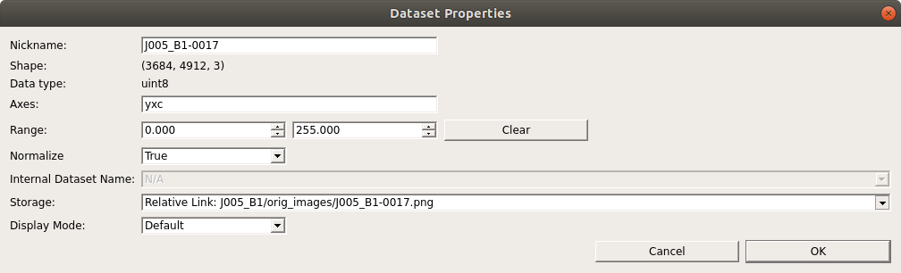
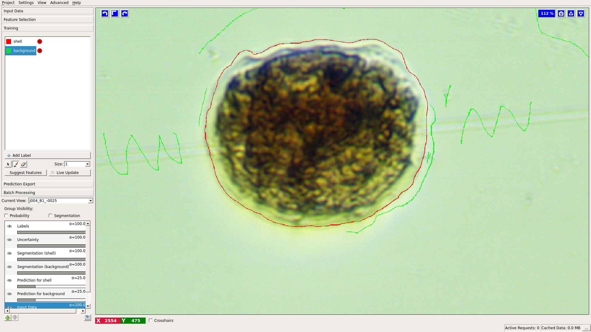
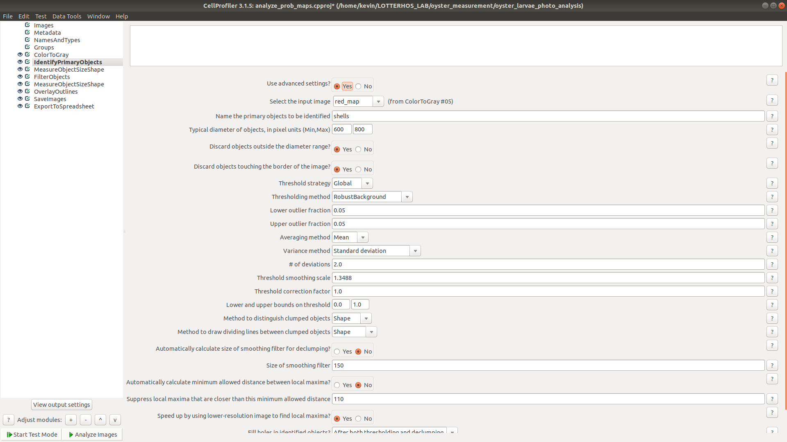

# Oyster Measurement

This is a pipeline used to easily measure the size of oyster larvae in a batch of images. There are 2 main steps:

1) Construct a probability map from the original images. This probability map is a visual representation of the probability that each pixel in an image is the edge of an oyster larvae shell

2) Give this map as input to CellProfiler, which will identify oyster larvae in the probability maps and measure them.

The final output is contained in two directories:

1) measurements. A collection of csv files representing the measurements of the oyster larvae in each image

2) overlays. Each original image overlayed with the outline of what CellProfiler identified as the oyster shell.

I included the folder for J006_B1 in the repository so you can see what the final output looks like. It includes all the original image files as well so you can test the scripts on them.

## Quick start 

The first thing you should do is add the src directory to your path:

`$ PATH=$PATH:~/oyster_measurement/src/`

You can add this line your bashrc file so that you don't have to do this everytime you log in. It should be stored at ~/.bashrc

You can download a dropbox image set directly from the command line. Go to the dropbox website, navigate to the folder that you want to download, click "share" then "Create a link". Click "copy link" and then you can paste the link into the command line to use in curl:

`$ curl -L https://www.dropbox.com/sh/n5exampleqs9/AACDlinkvq7408jb_vd0a?dl=1 > J006_B1.zip`

**You may have to edit the dropbox link by changing dl=0 to dl=1 at the end of the link**

Now to run the analysis, simply type the command 'analyze_oyster_larvae.sh' followed by the name of the folder where you downloaded the images.

`$ analyze_oyster_larvae.sh J006_B1`

*Takes 20 -30 minutes*

You're done! Inspect the overlays and see if everything looks good. Assuming you followed the setup instructions, you can use the same command on any image set by just changing J006_B1 to whatever your image set is called.

You can edit the Ilastik and CellProfiler pipelines or create your own by following the instructions below. If you edit the existing pipelines and put save them in the same directory, you can run the analysis without any changes. If you create new pipelines with different names, just edit src/ananlyze_oyster_larvae.sh to change the variables ilastikPipelins and cellpPipeline to whatever your new pipeline is called.

## Ilastik

### Training the classifier

Ilastik is a user-friendly tool to apply machine learning algorithms for image analysis. CellProfiler is compatible with Ilastik's output. In this case, I trained a random forest classifier to classify the pixels in an image as either background or shells. The best Ilastik classifier I created is included: 'generate_prob_maps.ilp'. There is certainly room for improvement and it should be easy to train a new classifier by following this simple, CellProfiler centric [tutorial](https://blog.cellprofiler.org/2017/01/19/cellprofiler-ilastik-superpowered-segmentation/). One thing that is not mentioned in the tutorial but that I found to be very helpful is to store the training images in the project file. You can do this in the input data section by right-clicking on the image, clicking edit properties, then changing the storage location to "copied to project file." Now the classifier does not depend on any external files or directory structures.

Contrary to the advice in the tutorial to label one pixel at a time, I got the best results by outlining the entire border of the shell like this:

### Generate the full set of probability maps

Once you have a classifier trained to your liking, you can transfer the project file to comp5 and run it on the entire image set using the included script "run_ilastik_for_cellprof.sh". It takes two named arguments -p/--project and -f/--file

project: the ilastik project file

file   : the image to be analyzed. It accepts globs

example execution:

`$ run_ilastik_for_cellp.sh -p ../generate_prob_maps.ilp -f orig_images/*`

This will run my included ilastik classifier on every image in the orig_images directory. This is the longest part of the analysis, it takes about 40s per image.

Output: a directory called 'prob_maps' that includes a probability map for each image  

## CellProfiler

### Image list

CellProfiler, when run headless, takes a list of images to analyze. When you call the included script runCellProfilerParallel.sh you provide it with an image set name. It will first look for a text file called [image set name].txt. If it finds this file it will use it as the list of images, if not it will attempt to create its own list. For this list to be created successfully you need to have your original image set stored in a directory called 'orig_images' and your probability maps to be stored in a directory called 'prob_maps', both residing in the directory you called the script from.

If you want a different image list than the one created automatically, the format is the absolute path to each image on its own line in a text file. They should be in the order you want them to be analyzed in. The header of runCellProfilerParallel.sh has some useful commands for creating such a file. 

### Running cellprofiler

You can now run Cellprofiler using runCellProfilerParallel.sh. It takes two unnamed argumets: 1) imageset name 2) cellprofiler pipeline

The image set name is used to find or create the image list file and to name the file.

There are also a couple variables you can modify in the script directly: ncpus (the maximum cpus you want the script to use) and batchsize (number of images to run on each cpu at once). The default batchsize is 1, which will run every image simulataneously, each on its own core. This is ideal unless you have more images than cores available, in which case it helps to set the batchsize to number of images / ncores. 

Example Execution:

`$runCellProfilerParallel.sh J006_B1 analyze_prob_maps.cppipe`

This should take under 3 minutes to run the entire set of images, unless you have less cores than images.

Output: A results directory that contains a directory of overlays and a directory of measurements. The results directory is named (imageset)+\_results\_+date+time. This is lengthy and ugly but helpful for this sort of project because finding the best settings in ilastik and CellProfiler is an iterative process where you are likely to anlyze the same set of images multiple times, getting better results each time.

### Modifying the CellProfiler pipeline:

There is certainly room to make the cellprofiler pipeline more accurate. If you want to experiment with it to increase the accuracy, open CellProfiler and then import the pipeline included here (analyze_prob_maps.cppipe). Load some images that it is having trouble identifying and enter CellProfiler's test mode to try different settings. Experimenting with the IdentifyPrimaryObjects module is the most likely way to improve your results. When you are satisfied with your results, export the pipeline file (not the project file) and use it as input for runCellProfilerParallel.sh. 

One thing to watch out for is to avoid changing the output settings if at all possible. I was not satisfied with the output options within CellProfiler so in the runCellProfilerParallel.sh script I included a call to another bash script that reorganizes and renames the output files. Changes to the format of the output files could break this script.
 
